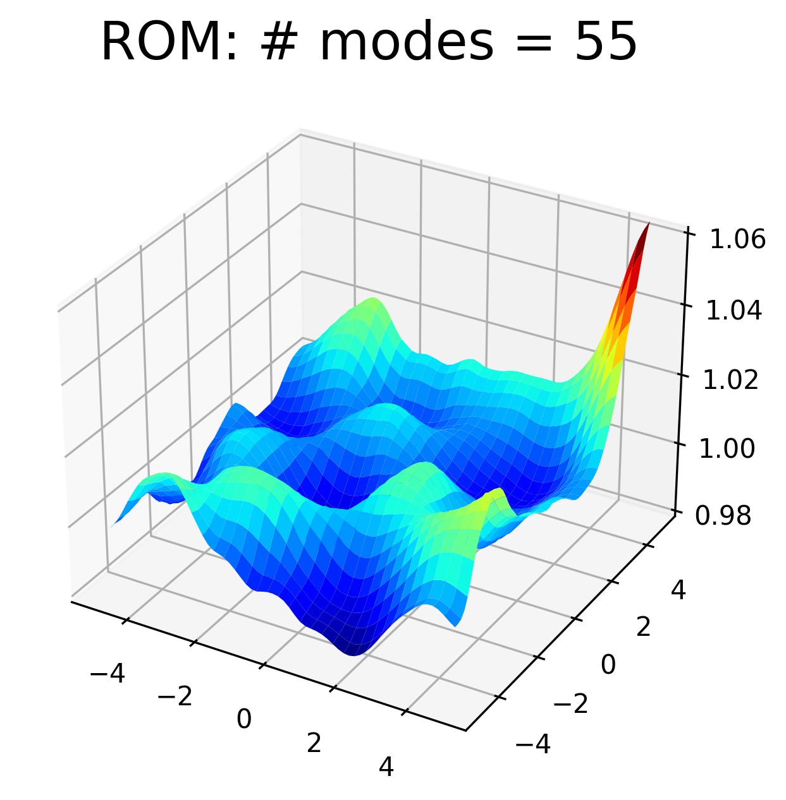

Default Galerkin for 2D SWE
===========================

- ROM technique: default Galerkin

- problem: `2D shallow water equations (SWE) <https://pressio.github.io/pressio-demoapps/swe_2d.html>`_

Prerequisites
-------------

- A valid build of the tutorials, see `here <../build.html>`__

- The following env variables set:

.. code-block:: bash

   export REPOSRC=<full-path-to-the-pressio-tutorials-source-repo>/end-to-end-roms
   export BUILDDIR=<full-path-to-where-you-built-the-tutorials>

- To run all scripts below, you MUST be in the correct end-to-end directory:

.. code-block:: bash

   cd $BUILDDIR/end-to-end-roms/2d_swe_galerkin_default

Workflow File
-------------

The `workflow file <../../../end-to-end-roms/2d_swe_galerkin_default/wf.yaml>`_
is shown below for exposition purposes, but it is automatically copied to the
build directory, so you don't need to do anything:

.. literalinclude:: ../../../end-to-end-roms/2d_swe_galerkin_default/wf.yaml
   :language: yaml
   :lines: 1-35
   :linenos:

Step 1: execute FOMs
--------------------

.. code-block:: bash

   # from within $BUILDDIR/end-to-end-roms/2d_swe_galerkin_default
   python3 $REPOSRC/wf_foms.py --wf wf.yaml

When we run the FOM driver, the following C++ code is being executed:

.. literalinclude:: ../../../end-to-end-roms/cpp/run_fom_explicit.hpp
   :language: cpp
   :lines: 9-31
   :linenos:

At the end, doing ``tree -L 1 .`` should produce:

.. code-block:: bash

   .
   ├── CMakeFiles
   ├── Makefile
   ├── cmake_install.cmake
   ├── fom_mesh
   ├── fom_test_runid_0
   ├── fom_train_runid_0
   ├── fom_train_runid_1
   ├── plot.py
   └── wf.yaml

Step 2: offline rom
-------------------

.. code-block:: bash

   # from within $BUILDDIR/end-to-end-roms/2d_swe_galerkin_default
   python3 $REPOSRC/wf_offline_rom.py --wf wf.yaml

The offline rom takes care of using the FOM training data to compute the POD modes,
and creates all data into an "offline_rom" subdirectory:

.. code-block:: bash

   ./offline_rom/
   ├── pod_input.yaml
   ├── rhs_left_singular_vectors.bin
   ├── rhs_singular_values.txt
   ├── rhs_snapshots.bin
   ├── state_left_singular_vectors.bin
   ├── state_singular_values.txt
   └── state_snapshots.bin

Step 3: galerkin rom
--------------------

.. code-block:: bash

   # from within $BUILDDIR/end-to-end-roms/2d_swe_galerkin_default
   python3 $REPOSRC/wf_galerkin.py --wf wf.yaml

The following C++ code is being executed:

.. literalinclude:: ../../../end-to-end-roms/cpp/run_default_galerkin.hpp
   :language: cpp
   :lines: 10-43
   :linenos:
   :emphasize-lines: 28

At the end, you should have the following directory structure:

.. code-block:: bash

   .
   ├── CMakeFiles
   ├── Makefile
   ├── cmake_install.cmake
   ├── default_galerkin_truncation_energybased_99.99999_runid_0
   ├── default_galerkin_truncation_energybased_99.999_runid_0
   ├── fom_mesh
   ├── fom_test_runid_0
   ├── fom_train_runid_0
   ├── fom_train_runid_1
   ├── offline_rom
   ├── plot.py
   └── wf.yaml

Step 4: process results
-----------------------

.. code-block:: bash

   # from within $BUILDDIR/end-to-end-roms/2d_swe_galerkin_default
   python3 $REPOSRC/wf_reconstruct_on_full_mesh.py
   python3 plot.py

.. image:: ../../../end-to-end-roms/2d_swe_galerkin_default/FOM.png
  :width: 32 %
  :alt: FOM
.. image:: ../../../end-to-end-roms/2d_swe_galerkin_default/ROM_22.png
  :width: 32 %
  :alt: ROM, 22 modes

