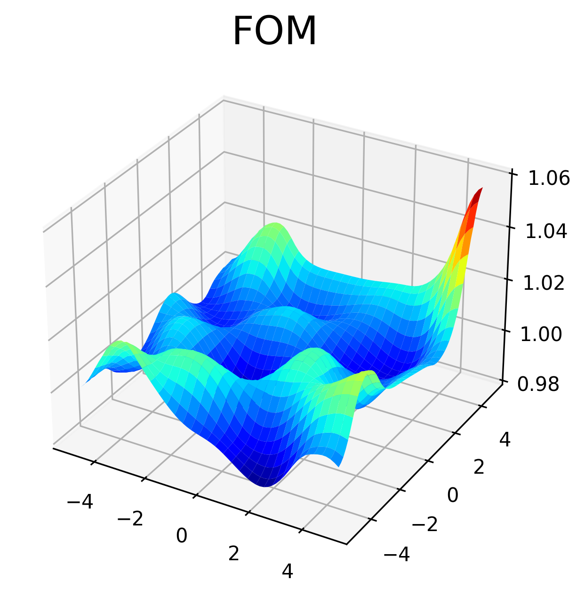
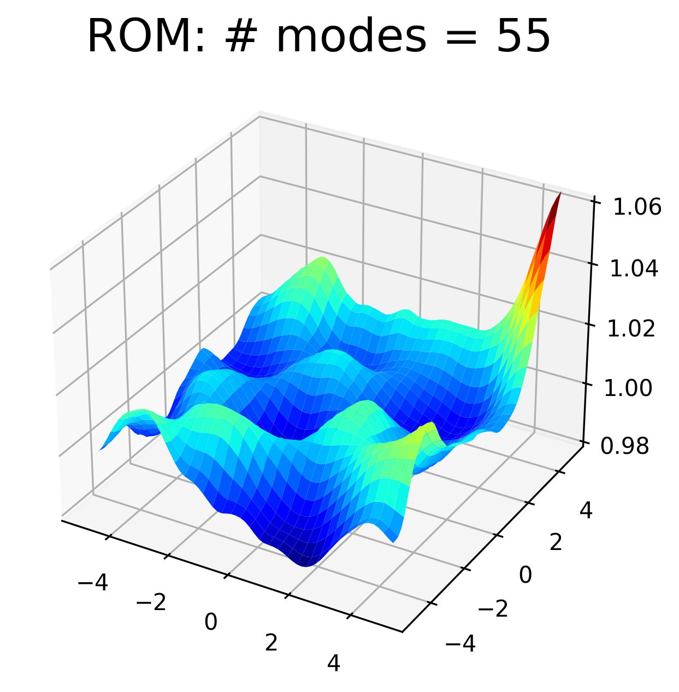

.. include:: ../mydefs.rst

2D SWE: hyper-reduced Galerkin (example 1)
==========================================

  - ROM technique: Hyper-reduced Galerkin with gappy POD

  - problem: `2D shallow water equations (SWE) <https://pressio.github.io/pressio-demoapps/swe_2d.html>`_

Prerequisites
-------------

- A valid build of the tutorials, see `here <../build.html>`__, and the following env variables set:

  .. code-block:: bash

     export REPOSRC=<full-path-to-the-pressio-tutorials-source-repo>/end-to-end-roms
     export BUILDDIR=<full-path-to-where-you-built-the-tutorials>

- To run all scripts below, you MUST be in the correct end-to-end directory:

  .. code-block:: bash

     cd $BUILDDIR/end-to-end-roms/2d_swe_galerkin_hypred_1

Workflow File
-------------

The `workflow file <../../../end-to-end-roms/2d_swe_galerkin_hypred_1/wf.yaml>`_
for this demo is shown below for exposition purposes, but it is automatically
copied to the build directory, so you don't need to do anything:

.. literalinclude:: ../../../end-to-end-roms/2d_swe_galerkin_hypred_1/wf.yaml
   :language: yaml
   :lines: 1-37
   :linenos:

Step 1: run FOMs
----------------

.. code-block:: bash

   python3 $REPOSRC/wf_foms.py --wf wf.yaml

The FOM stage is the same as `here <swe_galerkin_default.html>`_.

Step 2: offline rom
-------------------

.. code-block:: bash

   python3 $REPOSRC/wf_offline_rom.py --wf wf.yaml

The offline rom takes care of using the FOM training data to compute the POD modes,
computing samples meshes, and puts everything into an "offline_rom" subdirectory:

.. code-block:: bash

   offline_rom/
   ├── pod_input.yaml
   ├── rhs_left_singular_vectors.bin
   ├── rhs_singular_values.txt
   ├── rhs_snapshots.bin
   ├── sample_mesh_random_0.100
   ├── state_left_singular_vectors.bin
   ├── state_singular_values.txt
   └── state_snapshots.bin

Sample mesh
^^^^^^^^^^^

In this demo, we use the sample mesh which is generated by keeping
randomly 10% of the mesh cells. The whole sample mesh is done by presssio-demoapps.
Note the generated sample mesh directory ``sample_mesh_random_0.100``.
We can visualize the sample mesh as follows (note that given its random nature,
your plot might look slightly different):

.. code-block:: bash

   python3 $REPOSRC/../tpls/pressio-demoapps/meshing_scripts/plot_mesh.py \
           --wdir ./offline_rom/sample_mesh_random_0.100/ -p show

which shows a plot like the following (yellow cells denote the "sample mesh",
white cells denote the "stencil mesh"):

.. image:: ../../../end-to-end-roms/2d_swe_galerkin_hypred_1/mesh.png
  :width: 50 %
  :alt: Sample mesh
  :align: center

Step 3: galerkin rom
--------------------

.. code-block:: bash

   python3 $REPOSRC/wf_galerkin.py --wf wf.yaml

Running the Galerkin driver means the following C++ code is being executed:

.. literalinclude:: ../../../end-to-end-roms/cpp/run_hyperreduced_galerkin.hpp
   :language: cpp
   :lines: 57-109, 112-121, 126

At the end, you should have the following directory structure:

.. code-block:: bash

   .
   ├── CMakeFiles
   ├── Makefile
   ├── cmake_install.cmake
   ├── fom_mesh
   ├── fom_test_runid_0
   ├── fom_train_runid_0
   ├── fom_train_runid_1
   ├── hyperreduced_galerkin_truncation_energybased_99.99999_sample_mesh_random_0.100_runid_0
   ├── hyperreduced_galerkin_truncation_energybased_99.999_sample_mesh_random_0.100_runid_0
   ├── hyperreducer_99.99999_sample_mesh_random_0.100
   ├── hyperreducer_99.999_sample_mesh_random_0.100
   ├── offline_rom
   ├── plot.py
   └── wf.yaml

Step 4: process results
-----------------------

Accuracy
^^^^^^^^

.. code-block:: bash

   # from within $BUILDDIR/end-to-end-roms/2d_swe_default_galerkin
   python3 $REPOSRC/wf_reconstruct_on_full_mesh.py
   python3 plot.py

.. image:: ../../../end-to-end-roms/2d_swe_galerkin_hypred_1/ROM_22.png
  :width: 32 %
  :alt: ROM, 22 modes

Runtime comparison
^^^^^^^^^^^^^^^^^^

The results above show the accuracy, but we also want to assess the computational
gain. Thanks to the sample mesh, the runtime of the ROMs are
just a fraction of the FOM runtime. You can check this by doing

If you do ``tail -n 2 fom_*/out.log``, you see something as follows:

.. code-block:: text

   ==> fom_test_runid_0/out.log <==
   elapsed 6.71033
   [info] [1806179] Finalizing pressio logger

   ==> fom_train_runid_0/out.log <==
   elapsed 6.86063
   [info] [1805967] Finalizing pressio logger

   ==> fom_train_runid_1/out.log <==
   elapsed 6.75992
   [info] [1806103] Finalizing pressio logger

Then do ``tail -n 2 hyperreduced_*/out.log``, you will see:

.. code-block:: text

   ==> hyperreduced_galerkin_truncation_energybased_99.999_sample_mesh_random_0.100_runid_0/out.log <==
   elapsed 0.854369
   [info] [1812457] Finalizing pressio logger

   ==> hyperreduced_galerkin_truncation_energybased_99.99999_sample_mesh_random_0.100_runid_0/out.log <==
   elapsed 1.01332
   [info] [1812527] Finalizing pressio logger
