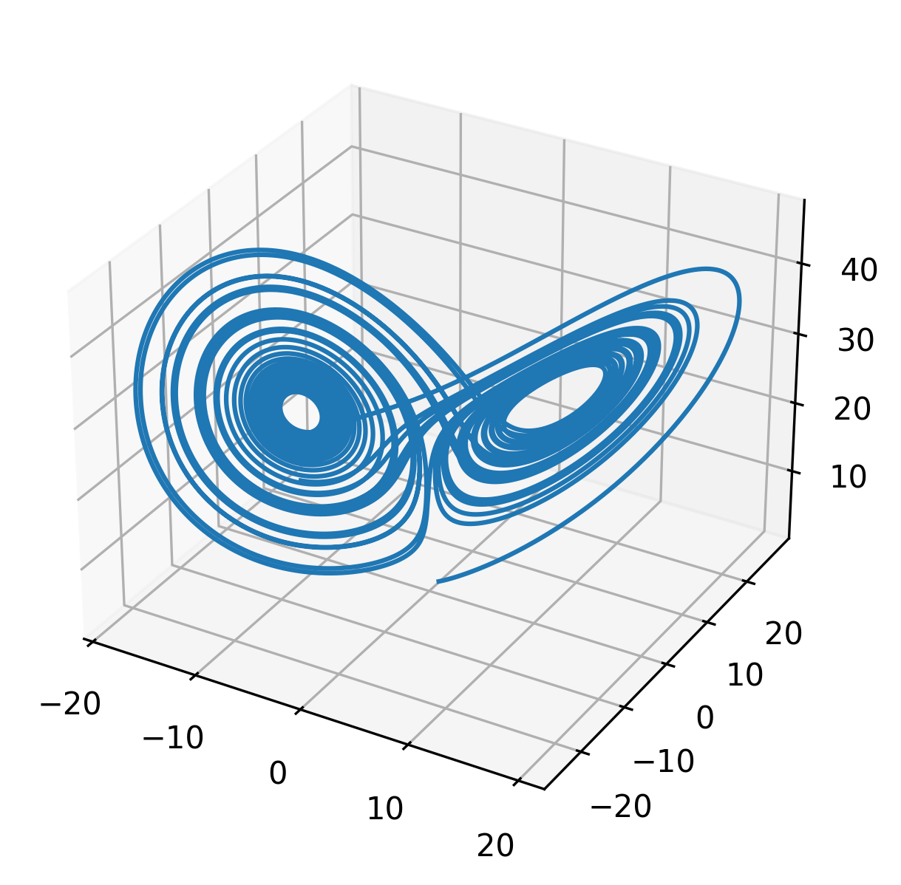

ode: tutorial 2
===============

Integrate the `original Lorenz system <https://en.wikipedia.org/wiki/Lorenz_system>`__ via explicit time integration.

.. literalinclude:: ../../../ode-using-eigen-types/tutorial2/main.cc
   :language: cpp
   :lines: 48-

Process results
---------------

Move to ``<your-build-dir>/ode-using-eigen-types/tutorial2`` and run:

.. code-block:: bash

   ./ode_eigen_exe2
   python3 plot.py

