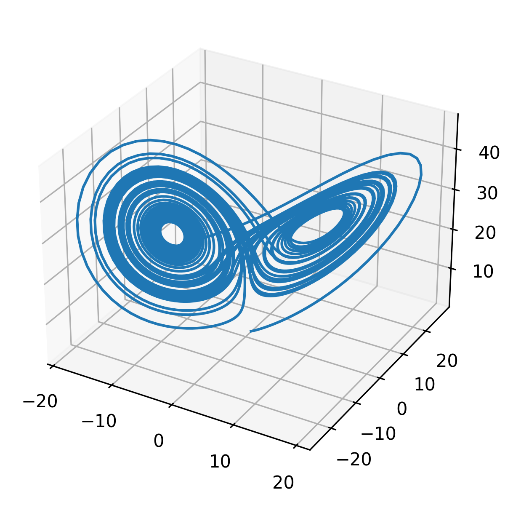

ode: tutorial 3
===============

This tutorial shows how to integrate the `original Lorenz system <https://en.wikipedia.org/wiki/Lorenz_system>`__ using implicit time integration.

.. literalinclude:: ../../../ode-using-eigen-types/tutorial3/main.cc
   :language: cpp
   :lines: 48-187

Process results
---------------

.. code-block:: bash

   # from within $BUILDDIR/ode-using-eigen-types/tutorial3
   python3 plot.py

